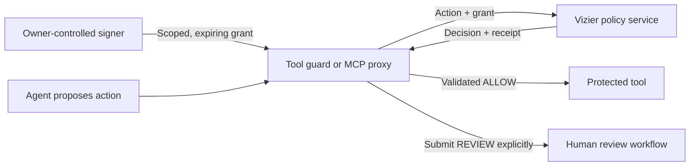

<!-- mcp-name: io.github.vassiliylakhonin/vizier-guard -->
# Vizier

**Scoped authorization for AI agents before they act.**

[](https://github.com/vassiliylakhonin/vizier/actions/workflows/ci.yml)
[](https://github.com/vassiliylakhonin/vizier/actions/workflows/deploy.yml)
[](https://github.com/vassiliylakhonin/vizier/releases)
[](LICENSE)

Vizier checks a proposed agent action against permissions signed by its owner.
It returns **ALLOW**, **BLOCK**, or **REVIEW**, together with policy results and a
receipt bound to the request. Your integration invokes the protected tool only
after validating the authorization.

Use it at the action boundary of an agent or recurring workflow: before a
deployment, repository write, database change, message, or payment API call.
A continuously running agent can receive short-lived permissions for specific
actions and targets while the owner keeps control of the signing key.

[Playground](https://vizier.vassiliy-lakhonin.workers.dev/playground) ·
[Live API reference](https://vizier.vassiliy-lakhonin.workers.dev/docs) ·
[OpenAPI](https://vizier.vassiliy-lakhonin.workers.dev/openapi.json) ·
[Delegation setup](docs/DELEGATION_GRANTS.md) ·
[Threat model](docs/THREAT_MODEL.md)

## How it works



1. The owner signs an ES256 delegation: principal, agent, permitted actions,
   constraints, and expiry. The operator registers only the public key in Vizier.
2. The integration submits the intended action and grant to `/v1/verify`.
3. Vizier verifies the signature, identities, expiry and exact authority binding,
   then evaluates deterministic policies. No LLM runs in this decision path.
4. The guard validates the response and request binding before invoking the tool.
   BLOCK, REVIEW, invalid responses and unavailable authorization stop that path.

**An API key authenticates the caller. A delegation grant proves the owner's
permission.** They have separate roles. A request cannot enlarge the authority
inside a valid grant; invalid grants are blocked.

The hosted deployment uses `VIZIER_SIGNED_GRANT_MODE=required` as of
**30 September 2026**. Unsigned verification requests return
`BLOCK / GRANT_REQUIRED`. A hosted ALLOW requires an operator-registered
principal key, a valid matching grant, and passing policies. Check `/docs` for
current deployment settings. Self-hosted optional mode permits caller-asserted
authority; its receipts do not establish owner delegation.

## Working integrations

These are owner-operated production workflows, not external customer adoption.

| Workflow | Protected action | Evidence |
| --- | --- | --- |
| Agenda deployment | `deploy_worker` on `worker:agent-output-verification-a2a` | [Signed deployment run](https://github.com/vassiliylakhonin/agenda-intelligence-md/actions/runs/36702604857) |
| Daily telemetry archive | `archive_telemetry` on the telemetry vault's `main` branch | [Workflow and archive](https://github.com/vassiliylakhonin/agenda-telemetry-vault), [authorization trace](https://github.com/vassiliylakhonin/agenda-telemetry-vault/blob/561c676a5088134a608d4b9ba14f7078036780bb/reports/authorizations/99a253ff5de4f038d08a3df13ed0bad6299f609966f22132271ff66b2c092472.json) |

The daily chain runs **collection → Agenda evidence preflight → Vizier
permission → Git write**. Agenda checks report structure and arithmetic against
supplied records; Vizier authorizes the write. The archive gate binds the
prepared changes and report digests to a receipt and skips an already recorded
GitHub run. The [live run](https://github.com/vassiliylakhonin/agenda-telemetry-vault/actions/runs/36706597715)
succeeded; rerunning it skipped the signing and write steps without another commit.

Both integrations use separate signer and execution steps, ten-minute grants,
and protected GitHub Environments. Missing or expired grants and invalid
receipts stop execution. Git path restrictions and duplicate-run handling belong
to the archive integration; they are not general replay guarantees from Vizier.

## Start with signed delegation

**Experimental v0.5.7.** TypeScript SDK and MCP proxy packages are available as
[GitHub Release archives](https://github.com/vassiliylakhonin/vizier/releases/tag/v0.5.7),
with `SHA256SUMS`. The `@vizier` npm scope is not currently published.

```sh
npm install https://github.com/vassiliylakhonin/vizier/releases/download/v0.5.7/vizier-sdk-0.5.7.tgz
```

First [register a principal public key and mint a grant](docs/DELEGATION_GRANTS.md#setting-it-up)
from an owner-controlled signer. This example requires a grant for
`platform-owner` → `release-agent`, with exactly this authority:

```json
{
  "allowed_actions": ["deploy_worker"],
  "constraints": {
    "allowed_targets": ["worker:example-worker"],
    "allowed_sensitive_actions": ["deploy_worker"]
  }
}
```

Keep the private signing key outside the action-taking agent. Supply the
integration API key and a current grant file to the trusted guard:

```ts
import { readFile } from "node:fs/promises";
import { Vizier } from "@vizier/sdk";

const client = new Vizier({
  baseUrl: "https://vizier.vassiliy-lakhonin.workers.dev",
  apiKey: process.env.VIZIER_API_KEY,
});

const grantPath = process.env.VIZIER_GRANT_FILE;
if (!grantPath) throw new Error("An owner-issued grant file is required.");
const grant = (await readFile(grantPath, "utf8")).trim();

const result = await client.verify({
  agent: { id: "release-agent", owner: "platform-owner" },
  principal: { id: "platform-owner" },
  action: {
    type: "deploy_worker",
    target: "worker:example-worker",
    parameters: { commit: "reviewed-commit" },
  },
  authority: {
    allowed_actions: ["deploy_worker"],
    constraints: {
      allowed_targets: ["worker:example-worker"],
      allowed_sensitive_actions: ["deploy_worker"],
    },
  },
  context: { request_id: null, timestamp: null, source: "rest" },
  grant,
});

// The SDK validates the response contract and recomputes the request hash.
const proof = result.receipt.grant;
if (
  result.decision !== "ALLOW" ||
  result.receipt.authority_provenance !== "principal_signed" ||
  proof?.issuer !== "platform-owner" ||
  proof?.subject !== "release-agent" ||
  Date.parse(proof.expires_at) <= Date.now()
) {
  throw new Error("Stop: no valid signed authorization for this action.");
}

// Invoke the fixed protected deployment here; record its actual outcome.
console.log("Authorized request:", result.receipt.id);
```

The example authorizes an action; it does not perform a deployment. An unknown
principal or key is blocked. For your own service origin, update both the client
URL and the grant audience. [Grant setup and rotation](docs/DELEGATION_GRANTS.md)
cover the full operator procedure.

For an MCP boundary, install both release archives:

```sh
npm install https://github.com/vassiliylakhonin/vizier/releases/download/v0.5.7/vizier-sdk-0.5.7.tgz https://github.com/vassiliylakhonin/vizier/releases/download/v0.5.7/vizier-mcp-proxy-0.5.7.tgz
```

Use the [mandatory proxy profile](docs/DELEGATION_GRANTS.md#mandatory-server-policy-v056)
with an operator-owned rotating grant file. The agent connects to the proxy;
its direct upstream route and downstream credentials must be removed. Exposing
Vizier as an optional MCP tool alone does not enforce a tool boundary.

## Interfaces and capabilities

| Surface | Role |
| --- | --- |
| REST `/v1/verify` | Action checks with deterministic policies, delegation provenance and request-bound receipts |
| TypeScript SDK | Validates response contracts and bindings; includes explicit human-review helpers |
| [Python SDK](packages/python-sdk) | Standard-library client, function guards and framework adapters |
| MCP service | Discover and call verification tools; [manifest](https://vizier.vassiliy-lakhonin.workers.dev/.well-known/mcp.json) |
| MCP enforcement proxy | Intercepts configured tool calls, validates authorization, and forwards permitted calls |
| A2A | Verification adapter and [agent card](https://vizier.vassiliy-lakhonin.workers.dev/.well-known/agent-card.json) |
| Human review queue | Separate reviewer credential, signed approval tokens and atomic server claims |

Policies cover permitted actions, targets, amount constraints, sensitive
operations and configured review requirements. SDK/proxy circuit breakers can
limit repeated tool calls and session budgets. Additional review workflows and
financial reservations have their own contracts and deployment requirements;
see [the live reference](https://vizier.vassiliy-lakhonin.workers.dev/docs) and
[financial reservation limitations](docs/FINANCIAL_RESERVATIONS.md).

## Receipts and trust boundary

A `/v1/verify` receipt records the request hash, decision, rule results and
authority provenance. **The legacy verification receipt itself is unsigned**;
the grant behind a `principal_signed` decision is owner-signed. The SDK checks
response consistency and recomputes the request hash over canonical JSON.
A receipt records authorization, not proof that a tool executed successfully.

Legacy Action Covenant and human-review tokens use separate signed receipt
formats. Required-grant mode blocks legacy covenant authorization because that
entrypoint does not carry a delegation grant. See
[the covenant contract](docs/ADR-0001-ACTION-COVENANTS.md) and
[the threat model](docs/THREAT_MODEL.md) before using compatibility surfaces.

Vizier is an application-level authorization service. The integration enforces
its decision. An agent or administrator with direct tool credentials can bypass
that integration. Short-lived grants are not single-use execution reservations.
Supplied evidence is not independently verified, and authorization does not
establish factual truth, legal clearance, payment settlement, or customer demand.

## Development

Node.js 24+ is required for the Worker and TypeScript packages.

```sh
npm ci
npm run check
```

`check` runs package builds, type checks, migration checks, lint, tests and a
Worker deployment dry run. It does not publish or deploy. Networked checks are
separate: `npm run check:deployed` checks the production bundle digest;
`npm run check:live` checks deployed service and discovery contracts.

[Architecture](docs/ARCHITECTURE.md) · [Claims](docs/CLAIMS.md) ·
[Security review](docs/SECURITY_REVIEW.md) · [Pilot scope](docs/PILOT.md) ·
[Issues and integration feedback](https://github.com/vassiliylakhonin/vizier/issues)

[MIT License](LICENSE).
